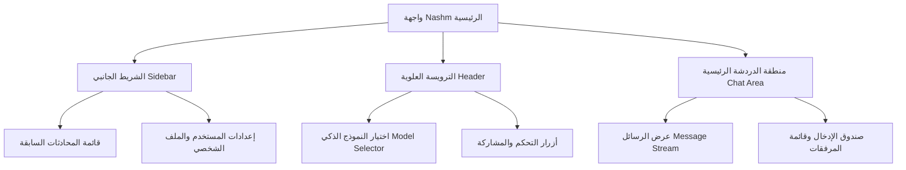

# دليل تصميم نظام الواجهة لموقع Nashm (Design System & Branding Guide)

هذا المستند يوفر شرحاً تفصيلياً وكاملاً لنظام التصميم (Design System)، الهوية البصرية (Branding)، الألوان، الخطوط، وتنسيق المكونات المستخدمة في موقع **Nashm**.

---

## 1. نظرة عامة (Overview)
موقع **Nashm** يعتمد على واجهة مستخدم (UI) عصرية تحاكي تطبيقات المحادثة الذكية المتقدمة (مثل ChatGPT). يرتكز التصميم على البساطة، السرعة، وسهولة القراءة، مع دعم كامل للوضعين الداكن (Dark Mode) والمضيء (Light Mode) وتجاوب تام (Responsive Design) مع جميع مقاسات الشاشات والهواتف المحمولة.

---

## 2. الخطوط (Typography)
يعتمد الموقع على عائلتين رئيسيتين من الخطوط تم تعريفهما في ملف التنسيق `style.css` وتكوين Tailwind CSS:

*   **الخط الأساسي للنصوص (Sans-serif)**:
    *   **Inter**: هو الخط الافتراضي المدمج بالدرجات (Regular 400, SemiBold 500, Bold 600) والخط المائل (Italic).
    *   **Söhne (اختياري/مرخص)**: يدعم الموقع الانتقال السلس إلى خط Söhne (الخط الخاص بـ ChatGPT) في حال توفر الترخيص والملفات في مسار `client/public/fonts/`.
*   **خط النصوص البرمجية والأكواد (Monospace)**:
    *   **Roboto Mono**: يُستخدم لعرض الأكواد البرمجية داخل كتل الشيفرات (Code Blocks) لتسهيل القراءة وتوضيح البنية التكوينية.

---

## 3. لوحة الألوان والألوان المتغيرة (Color Palette & CSS Variables)
تعتمد الواجهة على نظام **CSS Custom Properties** (المتغيرات) لتسهيل التبديل الفوري بين المظهر الفاتح والداكن.

### أ. الألوان المشتركة والأساسية (Global Palette)
تم تحديد الدرجات الرمادية والخضراء والحمراء كمتغيرات جذرية (`:root`):
*   **الرماديات (Gray)**: من الدرجة الفاتحة جداً `--gray-20` (`#ececf1`) إلى الداكنة جداً `--gray-900` (`#0d0d0d`).
*   **الأخضر (Green)**: مثل `--green-500` (`#10b981`) والدرجة الأغمق `--green-700` (`#047857`) لتقديم تفاعلات النجاح والأزرار الأساسية.
*   **الأحمر (Red)**: للتنبيهات والأخطاء والإجراءات المدمرة (مثل الحذف).
*   **البريد الأرجواني (Brand Purple)**: اللون المميّز للعلامة التجارية `--brand-purple: #ab68ff`.

### ب. الوضع المضيء (Light Mode)
تحت عنصر الـ `html` الافتراضي، يتم تعيين المتغيرات كالتالي:
*   **الخلفية الأساسية (Surface Primary)**: أبيض كامل `var(--white)` (`#ffffff`).
*   **الخلفية الثانوية (Surface Secondary)**: الرمادي الفاتح جداً `var(--gray-50)` لتمييز القوائم وشريط الدردشة.
*   **النص الأساسي (Text Primary)**: رمادي غامق `var(--gray-800)` لراحة العين أثناء القراءة.
*   **النص الثانوي (Text Secondary)**: رمادي متوسط `var(--gray-600)`.
*   **الحدود الفاصلة (Border Light / Medium)**: درجات رمادية خفيفة (`--gray-200` و `--gray-300`).

### ج. الوضع الداكن (Dark Mode)
يتم تفعيل الوضع الداكن عبر فئة `.dark` المضافة إلى عنصر `html`:
*   **الخلفية الأساسية (Surface Primary)**: رمادي داكن جداً `var(--gray-900)` (`#0d0d0d`).
*   **الخلفية الثانوية (Surface Secondary)**: رمادي داكن `var(--gray-800)` (`#212121`).
*   **الخلفية الثالثة للدردشة (Surface Chat)**: رمادي داكن متوسط `var(--gray-700)` (`#2f2f2f`).
*   **النص الأساسي (Text Primary)**: رمادي فاتح جداً يقارب الأبيض `var(--gray-100)` (`#ececec`).
*   **النص الثانوي (Text Secondary)**: رمادي فاتح `var(--gray-300)` (`#cdcdcd`).
*   **الحدود الفاصلة (Border Light)**: رمادي غامق `var(--gray-700)` لتجنب التباين الحاد المزعج للعين.

---

## 4. هيكل واجهة المستخدم (UI Layout & Architecture)
تتكون الشاشة الرئيسية لـ Nashm من ثلاثة أقسام رئيسية متناسقة ومبنية بمرونة متكاملة:

### أ. الشريط الجانبي (Sidebar)
*   يأخذ لون الخلفية الثانوية (`--surface-secondary`).
*   يحتوي على زر "محادثة جديدة" (New Chat) في الأعلى.
*   يسرد المحادثات السابقة مرتبة زمنياً، مع دعم تأثيرات الحوم (Hover Effects) لإظهار خيارات التعديل والحذف.
*   يضم في جزئه السفلي معلومات الحساب، قائمة الإعدادات، وزر تغيير الوضع المضيء/الداكن.
*   قابل للطي بالكامل لزيادة مساحة القراءة في الشاشات الصغيرة.

### ب. الترويسة العلوية (Header)
*   تتميز بخلفية شفافة خفيفة أو متطابقة مع الخلفية الأساسية.
*   تضم منسدلة اختيار النماذج (Model Select Dropdown) التي تدعم عرض النماذج المتاحة كأزرار ملونة متفاعلة (مثل خيارات Fast، Balanced، Precise الملونة بدرجات التدرج اللوني الجميل).

### ج. منطقة المحادثة (Main Chat Area)
*   **تدفق الرسائل (Message Stream)**:
    *   رسائل المستخدم تأخذ محاذاة لليمين/اليسار وتتميز بخلفية خفيفة مميزة أو بدون خلفية مع حدود ناعمة.
    *   ردود الذكاء الاصطناعي (AI Responses) يتم تنسيقها باستخدام مكونات Markdown وتدعم تمييز الأكواد البرمجية (Syntax Highlighting).
*   **صندوق الإدخال (Input Text Area)**:
    *   يتموضع في منتصف الجزء السفلي بشكل عائم أو ثابت مع زوايا دائرية كبيرة.
    *   يحتوي على أيقونات لإرفاق الملفات، اختيار التوجيهات السريعة (Prompts)، وزر الإرسال الأخضر الدائري المتفاعل.

---

## 5. التخصيص المتقدم والعلامة التجارية (Custom Branding)
يدعم Nashm تخصيص الهوية البصرية بسهولة عبر ملف الإعدادات المخصص `Nashm.yaml`:

*   **رسالة الترحيب المخصصة (Custom Welcome Message)**:
    *   تم إعداد رسالة ترحيب مخصصة باللغة العربية: **"مرحباً بك!"** تظهر للمستخدم في بداية أي محادثة جديدة لتضفي طابعاً ترحيبياً دافئاً.
*   **شعار الموقع المخصص (Custom Logo & Assets)**:
    *   يتم حفظ وتعديل الصور والشعارات المخصصة ضمن مجلد الأصول التابع للعميل:
        *   `client/public/images/`
        *   يحتوي المجلد الفرعي على الشعار الافتراضي أو المرفوع كأصل من أصول العلامة التجارية المخصصة للموقع.

---

## 6. التحريكات والمؤثرات التفاعلية (Micro-animations)
لتحسين تجربة المستخدم وجعل الواجهة تبدو حية وتفاعلية، تم تضمين التأثيرات الحركية التالية:
*   **مؤشر الكتابة الوامض (Blinking Cursor)**:
    *   يتحرك بنعومة أثناء توليد الذكاء الاصطناعي للردود لمحاكاة الكتابة الحية (`animation: blink 1s linear infinite`).
*   **زر الانتقال للأسفل (Scroll to Bottom Button)**:
    *   يظهر ويختفي بنعومة تامة عند تصفح المحادثات السابقة باستخدام تحريكات مقياس الحجم والإزاحة العمودية (`scroll-btn-enter` و `scroll-btn-exit`).
*   **تدرجات التبويبات (Gradient Tabs)**:
    *   تضم الواجهة تصنيفات ملونة ذات تدرجات لونية ممتازة:
        *   `balanced-tab`: تدرج ذهبي برتقالي دافئ.
        *   `fast-tab`: تدرج أزرق عصري وسريع.
        *   `creative-tab`: تدرج بنفسجي ووردي فخم.
        *   `precise-tab`: تدرج سماوي كحلي دقيق.

---

## 7. التصميم المتجاوب وتجربة الهواتف (Responsive Design)
*   **شاشات الموبايل**: يتم إخفاء الشريط الجانبي تلقائياً ويتحول إلى قائمة جانبية تنسحب من الجانب الأيسر/الأيمن عند النقر على أيقونة القائمة (Hamburger Menu).
*   **ملف `mobile.css`**: يحتوي على قواعد استعلامات الوسائط (Media Queries) الخاصة بالهواتف لضمان تناسق أحجام النصوص، وحذف التدرجات المعقدة في الشاشات الصغيرة لتحسين الأداء وسرعة التحميل (`no-gradient-sm`).

---

هذا المستند يعتبر مرجعاً متكاملاً للمطورين والمصممين لضمان الحفاظ على اتساق الهوية البصرية لـ Nashm أثناء عمليات التطوير والتعديل المستمرة.
