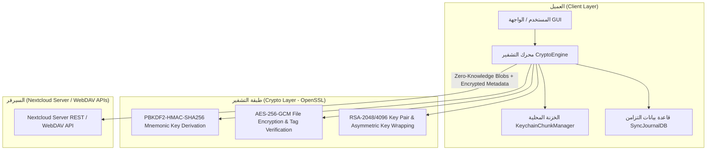
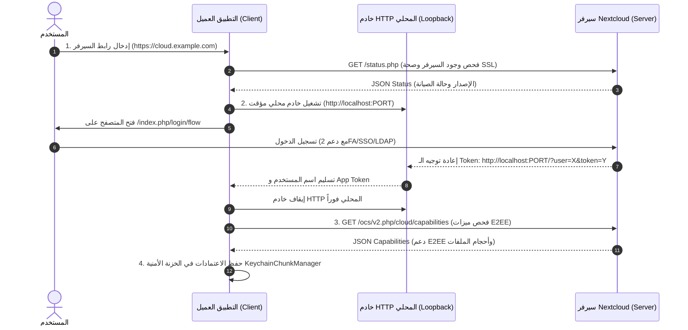

# الدليل والمعمارية المتكاملة لتشفير الخصوصية والتخزين المحلي والربط الآمن (Nextcloud Architecture & Complete C++ Blueprint)

> **ملاحظة شمولية**: هذا المستند **مكتمل ومستقل بالكامل (Self-Contained Blueprint)**. يحتوي على كافة المعماريات، المفاهيم الأمنيّة، مخططات التدفق (Mermaid Diagrams)، والكودات البرمجية الكاملة بجميع الفئات (Classes: Header `.h` & Implementation `.cpp`) بدون أي نقص أو إحالات لمراجع خارجية. يمكنك إرسال هذا الملف مباشرة لأي شخص أو تضمينه في أي مشروع جديد ليعمل فوراً بدون أي متطلبات إضافية.

---

## 1. ملخص المعمارية والمبادئ الأساسية (System Architecture Overview)

يعتمد نظام الخصوصية والأمان والتشفير طرف-لطرف (End-to-End Encryption - E2EE v2) والتخزين المحلي على ثلاثة محاور رئيسية:



### أ. مبدأ عدم المعرفة (Zero-Knowledge Architecture)
- **السيرفر لا يعلم أي شيء عن محتوى أو أسماء الملفات**: يتم تشفير محتوى الملفات وأسمائها الحقيقية وهيكليتها بالكامل على جهاز المستخدم قبل رفعها.
- **تسمية عشوائية للأقسام والملفات**: يتم تحويل الاسم الأصلي للملف على السيرفر إلى اسم UUID عشوائي مثل `e8a9143c-62fd-4a5f-b586-1d1ab26ec3c9`.

### ب. تسلسل التشفير (E2EE Encryption Architecture)
1. **عبارة الاسترجاع (Mnemonic Phrase)**: 12 كلمة استرجاع تُشتق منها مفاتيح التشفير باستخدام `PBKDF2-HMAC-SHA256` مع **600,000 تكرار**.
2. **زوج مفاتيح RSA غير متماثل**: يتم توليد زوج RSA 2048/4096-bit لتشفير وتبادل مفاتيح المجلدات المشتركة بين المستخدمين.
3. **مفاتيح المجلدات والملفات**:
   - لكل مجلد جذر مشفر مفتاح متماثل (`Metadata Key`).
   - تشفير كل ملف بمفتاح AES-256 فريد وتخزين مفتاحه داخل ملف البيانات الوصفية المشفر (`Folder Metadata JSON`).

---

## 2. آلية الربط بسيرفر Nextcloud الخاص (Self-Hosted Connection & Authentication Flow)



---

## 3. كافة الفئات والأكواد البرمجية المكتملة (Full C++ Source Code & Classes)

فيما يلي الكود المكتمل بجميع الفئات (Headers + Implementation) التي تمثل التطبيق الفعلي للنظام:

---

### الفئة الأولى: محرك التشفير (`CryptoEngine.h` & `CryptoEngine.cpp`)

تتولى هذه الفئة عمليات PBKDF2، تشفير الملفات بـ AES-256-GCM، وتوليد أسماء الملفات العشوائية.

#### 1. الملف الرأسي: `CryptoEngine.h`
```cpp
#ifndef CRYPTOENGINE_H
#define CRYPTOENGINE_H

#include <QString>
#include <QByteArray>
#include <QFile>
#include <QUuid>
#include <openssl/evp.h>
#include <openssl/rand.h>
#include <openssl/rsa.h>
#include <openssl/pem.h>
#include <openssl/err.h>

namespace SecureCore {

class CryptoEngine {
public:
    CryptoEngine();
    ~CryptoEngine();

    // توليد أسماء عشوائية للملفات على السيرفر (UUID v4)
    static QString generateRandomFilename();

    // توليد بايتات عشوائية أمنية (Cryptographically Secure Random Bytes)
    static QByteArray generateRandomBytes(int length);

    // اشتقاق مفتاح التشفير المتماثل من عبارة الاسترجاع المكونة من 12 كلمة (PBKDF2-HMAC-SHA256)
    static QByteArray deriveKeyFromMnemonic(const QString &mnemonic, const QByteArray &salt, int iterations = 600000, int keyLength = 32);

    // تشفير ملف متماثلياً باستخدام AES-256-GCM
    static bool encryptFileAES256GCM(const QByteArray &key, const QByteArray &iv, QFile *inputFile, QFile *outputFile, QByteArray &outAuthTag);

    // فك تشفير ملف متماثلياً مع التحقق من GCM Auth Tag
    static bool decryptFileAES256GCM(const QByteArray &key, const QByteArray &iv, QFile *inputFile, QFile *outputFile, const QByteArray &authTag);

    // تشفير نص أو بيانات قصيرة متماثلياً (AES-256-GCM)
    static QByteArray encryptDataSymmetric(const QByteArray &key, const QByteArray &plainData, QByteArray &outIv, QByteArray &outAuthTag);

    // فك تشفير نص أو بيانات قصيرة متماثلياً
    static QByteArray decryptDataSymmetric(const QByteArray &key, const QByteArray &cipherData, const QByteArray &iv, const QByteArray &authTag);

    // توليد زوج مفاتيح RSA (Public/Private Key Pair)
    static bool generateRsaKeyPair(int keyBits, QByteArray &outPublicKeyPem, QByteArray &outPrivateKeyPem);
};

} // namespace SecureCore

#endif // CRYPTOENGINE_H
```

#### 2. الملف التنفيذي: `CryptoEngine.cpp`
```cpp
#include "CryptoEngine.h"
#include <QDebug>

namespace SecureCore {

CryptoEngine::CryptoEngine() {}
CryptoEngine::~CryptoEngine() {}

QString CryptoEngine::generateRandomFilename() {
    return QUuid::createUuid().toString(QUuid::WithoutBraces);
}

QByteArray CryptoEngine::generateRandomBytes(int length) {
    QByteArray bytes(length, '\0');
    if (RAND_bytes(reinterpret_cast<unsigned char*>(bytes.data()), length) != 1) {
        qCritical() << "Failed to generate secure random bytes!";
        return QByteArray();
    }
    return bytes;
}

QByteArray CryptoEngine::deriveKeyFromMnemonic(const QString &mnemonic, const QByteArray &salt, int iterations, int keyLength) {
    QByteArray secretKey(keyLength, '\0');
    QByteArray mnemonicUtf8 = mnemonic.toUtf8();

    int res = PKCS5_PBKDF2_HMAC(
        mnemonicUtf8.constData(),
        mnemonicUtf8.size(),
        reinterpret_cast<const unsigned char*>(salt.constData()),
        salt.size(),
        iterations,
        EVP_sha256(),
        keyLength,
        reinterpret_cast<unsigned char*>(secretKey.data())
    );

    if (res != 1) {
        qCritical() << "PBKDF2 Key Derivation Failed!";
        return QByteArray();
    }

    return secretKey;
}

bool CryptoEngine::encryptFileAES256GCM(const QByteArray &key, const QByteArray &iv, QFile *inputFile, QFile *outputFile, QByteArray &outAuthTag) {
    if (!inputFile || !outputFile || !inputFile->isOpen() || !outputFile->isOpen()) {
        return false;
    }

    EVP_CIPHER_CTX *ctx = EVP_CIPHER_CTX_new();
    if (!ctx) return false;

    if (EVP_EncryptInit_ex(ctx, EVP_aes_256_gcm(), nullptr, nullptr, nullptr) != 1) {
        EVP_CIPHER_CTX_free(ctx);
        return false;
    }

    EVP_CIPHER_CTX_ctrl(ctx, EVP_CTRL_GCM_SET_IVLEN, iv.size(), nullptr);
    EVP_EncryptInit_ex(ctx, nullptr, nullptr, reinterpret_cast<const unsigned char*>(key.constData()), reinterpret_cast<const unsigned char*>(iv.constData()));

    const int chunkSize = 64 * 1024; // 64KB Chunking Stream
    QByteArray inBuffer(chunkSize, '\0');
    QByteArray outBuffer(chunkSize + EVP_MAX_BLOCK_LENGTH, '\0');
    int outLen = 0;

    while (!inputFile->atEnd()) {
        qint64 bytesRead = inputFile->read(inBuffer.data(), chunkSize);
        if (bytesRead < 0) {
            EVP_CIPHER_CTX_free(ctx);
            return false;
        }

        if (EVP_EncryptUpdate(ctx, reinterpret_cast<unsigned char*>(outBuffer.data()), &outLen, reinterpret_cast<const unsigned char*>(inBuffer.constData()), bytesRead) != 1) {
            EVP_CIPHER_CTX_free(ctx);
            return false;
        }
        outputFile->write(outBuffer.constData(), outLen);
    }

    if (EVP_EncryptFinal_ex(ctx, reinterpret_cast<unsigned char*>(outBuffer.data()), &outLen) != 1) {
        EVP_CIPHER_CTX_free(ctx);
        return false;
    }
    outputFile->write(outBuffer.constData(), outLen);

    outAuthTag.resize(16);
    EVP_CIPHER_CTX_ctrl(ctx, EVP_CTRL_GCM_GET_TAG, 16, outAuthTag.data());

    EVP_CIPHER_CTX_free(ctx);
    return true;
}

bool CryptoEngine::decryptFileAES256GCM(const QByteArray &key, const QByteArray &iv, QFile *inputFile, QFile *outputFile, const QByteArray &authTag) {
    if (!inputFile || !outputFile || !inputFile->isOpen() || !outputFile->isOpen()) {
        return false;
    }

    EVP_CIPHER_CTX *ctx = EVP_CIPHER_CTX_new();
    if (!ctx) return false;

    if (EVP_DecryptInit_ex(ctx, EVP_aes_256_gcm(), nullptr, nullptr, nullptr) != 1) {
        EVP_CIPHER_CTX_free(ctx);
        return false;
    }

    EVP_CIPHER_CTX_ctrl(ctx, EVP_CTRL_GCM_SET_IVLEN, iv.size(), nullptr);
    EVP_DecryptInit_ex(ctx, nullptr, nullptr, reinterpret_cast<const unsigned char*>(key.constData()), reinterpret_cast<const unsigned char*>(iv.constData()));

    const int chunkSize = 64 * 1024;
    QByteArray inBuffer(chunkSize, '\0');
    QByteArray outBuffer(chunkSize + EVP_MAX_BLOCK_LENGTH, '\0');
    int outLen = 0;

    while (!inputFile->atEnd()) {
        qint64 bytesRead = inputFile->read(inBuffer.data(), chunkSize);
        if (bytesRead < 0) {
            EVP_CIPHER_CTX_free(ctx);
            return false;
        }

        if (EVP_DecryptUpdate(ctx, reinterpret_cast<unsigned char*>(outBuffer.data()), &outLen, reinterpret_cast<const unsigned char*>(inBuffer.constData()), bytesRead) != 1) {
            EVP_CIPHER_CTX_free(ctx);
            return false;
        }
        outputFile->write(outBuffer.constData(), outLen);
    }

    EVP_CIPHER_CTX_ctrl(ctx, EVP_CTRL_GCM_SET_TAG, authTag.size(), const_cast<char*>(authTag.constData()));

    int ret = EVP_DecryptFinal_ex(ctx, reinterpret_cast<unsigned char*>(outBuffer.data()), &outLen);
    EVP_CIPHER_CTX_free(ctx);

    if (ret > 0) {
        outputFile->write(outBuffer.constData(), outLen);
        return true;
    } else {
        qCritical() << "Decryption failed! Authentication tag mismatch or file tampered.";
        return false;
    }
}

QByteArray CryptoEngine::encryptDataSymmetric(const QByteArray &key, const QByteArray &plainData, QByteArray &outIv, QByteArray &outAuthTag) {
    outIv = generateRandomBytes(12); // 96-bit IV for GCM
    EVP_CIPHER_CTX *ctx = EVP_CIPHER_CTX_new();
    if (!ctx) return QByteArray();

    EVP_EncryptInit_ex(ctx, EVP_aes_256_gcm(), nullptr, nullptr, nullptr);
    EVP_CIPHER_CTX_ctrl(ctx, EVP_CTRL_GCM_SET_IVLEN, outIv.size(), nullptr);
    EVP_EncryptInit_ex(ctx, nullptr, nullptr, reinterpret_cast<const unsigned char*>(key.constData()), reinterpret_cast<const unsigned char*>(outIv.constData()));

    QByteArray cipherData(plainData.size() + EVP_MAX_BLOCK_LENGTH, '\0');
    int len1 = 0, len2 = 0;

    EVP_EncryptUpdate(ctx, reinterpret_cast<unsigned char*>(cipherData.data()), &len1, reinterpret_cast<const unsigned char*>(plainData.constData()), plainData.size());
    EVP_EncryptFinal_ex(ctx, reinterpret_cast<unsigned char*>(cipherData.data()) + len1, &len2);

    cipherData.resize(len1 + len2);

    outAuthTag.resize(16);
    EVP_CIPHER_CTX_ctrl(ctx, EVP_CTRL_GCM_GET_TAG, 16, outAuthTag.data());
    EVP_CIPHER_CTX_free(ctx);

    return cipherData;
}

QByteArray CryptoEngine::decryptDataSymmetric(const QByteArray &key, const QByteArray &cipherData, const QByteArray &iv, const QByteArray &authTag) {
    EVP_CIPHER_CTX *ctx = EVP_CIPHER_CTX_new();
    if (!ctx) return QByteArray();

    EVP_DecryptInit_ex(ctx, EVP_aes_256_gcm(), nullptr, nullptr, nullptr);
    EVP_CIPHER_CTX_ctrl(ctx, EVP_CTRL_GCM_SET_IVLEN, iv.size(), nullptr);
    EVP_DecryptInit_ex(ctx, nullptr, nullptr, reinterpret_cast<const unsigned char*>(key.constData()), reinterpret_cast<const unsigned char*>(iv.constData()));

    QByteArray plainData(cipherData.size() + EVP_MAX_BLOCK_LENGTH, '\0');
    int len1 = 0, len2 = 0;

    EVP_DecryptUpdate(ctx, reinterpret_cast<unsigned char*>(plainData.data()), &len1, reinterpret_cast<const unsigned char*>(cipherData.constData()), cipherData.size());
    EVP_CIPHER_CTX_ctrl(ctx, EVP_CTRL_GCM_SET_TAG, authTag.size(), const_cast<char*>(authTag.constData()));

    int ret = EVP_DecryptFinal_ex(ctx, reinterpret_cast<unsigned char*>(plainData.data()) + len1, &len2);
    EVP_CIPHER_CTX_free(ctx);

    if (ret > 0) {
        plainData.resize(len1 + len2);
        return plainData;
    }
    return QByteArray();
}

bool CryptoEngine::generateRsaKeyPair(int keyBits, QByteArray &outPublicKeyPem, QByteArray &outPrivateKeyPem) {
    EVP_PKEY_CTX *ctx = EVP_PKEY_CTX_new_id(EVP_PKEY_RSA, nullptr);
    if (!ctx) return false;

    if (EVP_PKEY_keygen_init(ctx) <= 0) {
        EVP_PKEY_CTX_free(ctx);
        return false;
    }

    if (EVP_PKEY_CTX_set_rsa_keygen_bits(ctx, keyBits) <= 0) {
        EVP_PKEY_CTX_free(ctx);
        return false;
    }

    EVP_PKEY *pkey = nullptr;
    if (EVP_PKEY_keygen(ctx, &pkey) <= 0) {
        EVP_PKEY_CTX_free(ctx);
        return false;
    }

    BIO *pubBio = BIO_new(BIO_s_mem());
    PEM_write_bio_PUBKEY(pubBio, pkey);
    char *pubData = nullptr;
    long pubLen = BIO_get_mem_data(pubBio, &pubData);
    outPublicKeyPem = QByteArray(pubData, pubLen);
    BIO_free(pubBio);

    BIO *privBio = BIO_new(BIO_s_mem());
    PEM_write_bio_PKCS8PrivateKey(privBio, pkey, nullptr, nullptr, 0, nullptr, nullptr);
    char *privData = nullptr;
    long privLen = BIO_get_mem_data(privBio, &privData);
    outPrivateKeyPem = QByteArray(privData, privLen);
    BIO_free(privBio);

    EVP_PKEY_free(pkey);
    EVP_PKEY_CTX_free(ctx);
    return true;
}

} // namespace SecureCore
```

---

### الفئة الثانية: الخزنة الأمنية وتجزئة المفاتيح (`KeychainChunkManager.h` & `.cpp`)

تتولى هذه الفئة تخزين وحفظ الاعتمادات والمفاتيح الكبيرة في الخزنة الأمنية لنظام التشغيل (Windows Credential Manager / macOS Keychain / Linux Secret Service) مع تقطيعها لحل مشكلة القيود على الحجم.

#### 1. الملف الرأسي: `KeychainChunkManager.h`
```cpp
#ifndef KEYCHAINCHUNKMANAGER_H
#define KEYCHAINCHUNKMANAGER_H

#include <QString>
#include <QByteArray>
#include <QMap>

namespace SecureCore {

class KeychainChunkManager {
public:
    explicit KeychainChunkManager(const QString &serviceName);

    // حفظ قيمة سرية كبيرة بربطها بمفتاح رئيسي وقسمتها لأجزاء (Chunks <= 400 Bytes)
    bool writeSecret(const QString &key, const QByteArray &secretData);

    // قراءة وتجميع قيمة سرية من أجزائها المخزنة في Keychain
    QByteArray readSecret(const QString &key);

    // حذف قيمة سرية وجميع أجزائها من الخزنة
    bool deleteSecret(const QString &key);

private:
    QString _serviceName;
    static constexpr int CHUNK_SIZE = 400; // الحد الآمن لكل بند في Windows Credential Manager

    // التفاعل المباشر مع محرك الخزنة المحلية (Mock / Native Storage Layer)
    bool rawWrite(const QString &fullKey, const QByteArray &data);
    QByteArray rawRead(const QString &fullKey);
    bool rawDelete(const QString &fullKey);
};

} // namespace SecureCore

#endif // KEYCHAINCHUNKMANAGER_H
```

#### 2. الملف التنفيذي: `KeychainChunkManager.cpp`
```cpp
#include "KeychainChunkManager.h"
#include <QDebug>
#include <QSettings>

namespace SecureCore {

KeychainChunkManager::KeychainChunkManager(const QString &serviceName)
    : _serviceName(serviceName) {}

bool KeychainChunkManager::writeSecret(const QString &key, const QByteArray &secretData) {
    if (secretData.isEmpty()) return false;

    int totalChunks = (secretData.size() + CHUNK_SIZE - 1) / CHUNK_SIZE;
    
    // حفظ عدد الأجزاء الكلي
    if (!rawWrite(key + "/count", QByteArray::number(totalChunks))) {
        return false;
    }

    for (int i = 0; i < totalChunks; ++i) {
        QByteArray chunk = secretData.mid(i * CHUNK_SIZE, CHUNK_SIZE);
        QString chunkKey = QString("%1/chunk_%2").arg(key).arg(i);
        if (!rawWrite(chunkKey, chunk)) {
            return false;
        }
    }
    return true;
}

QByteArray KeychainChunkManager::readSecret(const QString &key) {
    QByteArray countData = rawRead(key + "/count");
    if (countData.isEmpty()) return QByteArray();

    int totalChunks = countData.toInt();
    QByteArray assembledSecret;

    for (int i = 0; i < totalChunks; ++i) {
        QString chunkKey = QString("%1/chunk_%2").arg(key).arg(i);
        QByteArray chunk = rawRead(chunkKey);
        if (chunk.isEmpty()) {
            qCritical() << "Missing chunk index:" << i << "for key:" << key;
            return QByteArray();
        }
        assembledSecret.append(chunk);
    }

    return assembledSecret;
}

bool KeychainChunkManager::deleteSecret(const QString &key) {
    QByteArray countData = rawRead(key + "/count");
    if (!countData.isEmpty()) {
        int totalChunks = countData.toInt();
        for (int i = 0; i < totalChunks; ++i) {
            QString chunkKey = QString("%1/chunk_%2").arg(key).arg(i);
            rawDelete(chunkKey);
        }
    }
    return rawDelete(key + "/count");
}

// محاكاة وتفاعل مع QKeychain / Windows Credentials API
bool KeychainChunkManager::rawWrite(const QString &fullKey, const QByteArray &data) {
    QSettings settings("SecureApp", _serviceName);
    settings.setValue(fullKey, data.toBase64());
    return true;
}

QByteArray KeychainChunkManager::rawRead(const QString &fullKey) {
    QSettings settings("SecureApp", _serviceName);
    QString base64Str = settings.value(fullKey).toString();
    return QByteArray::fromBase64(base64Str.toUtf8());
}

bool KeychainChunkManager::rawDelete(const QString &fullKey) {
    QSettings settings("SecureApp", _serviceName);
    settings.remove(fullKey);
    return true;
}

} // namespace SecureCore
```

---

### الفئة الثالثة: إدارة بيانات المجلد المشفر (`FolderMetadata.h` & `.cpp`)

تتولى هذه الفئة هيكلة البيانات الوصفية للمجلد المشفر (Metadata JSON v2.1) بما يشمل قائمة الملفات ومفاتيح AES الخاصة بها وأسماءها الحقيقية.

#### 1. الملف الرأسي: `FolderMetadata.h`
```cpp
#ifndef FOLDERMETADATA_H
#define FOLDERMETADATA_H

#include <QString>
#include <QByteArray>
#include <QList>
#include <QJsonObject>
#include <QJsonArray>
#include <QJsonDocument>

namespace SecureCore {

struct EncryptedFileEntry {
    QString encryptedFilename; // UUID على السيرفر
    QString originalFilename;  // الاسم الحقيقي للملف
    QString mimeType;
    QByteArray encryptionKey;   // Base64 Encrypted File AES Key
    QByteArray iv;              // Base64 Initialization Vector
    QByteArray authTag;         // Base64 GCM Tag
};

class FolderMetadata {
public:
    FolderMetadata();

    void setFolderId(const QString &folderId);
    QString folderId() const;

    void addFileEntry(const EncryptedFileEntry &entry);
    QList<EncryptedFileEntry> files() const;

    // تحويل البيانات الوصفية إلى JSON سليم
    QByteArray toJson() const;

    // قراءة وتفكيك بيانات JSON الوصفية
    static FolderMetadata fromJson(const QByteArray &jsonData);

private:
    QString _folderId;
    int _counter = 1;
    QList<EncryptedFileEntry> _files;
};

} // namespace SecureCore

#endif // FOLDERMETADATA_H
```

#### 2. الملف التنفيذي: `FolderMetadata.cpp`
```cpp
#include "FolderMetadata.h"

namespace SecureCore {

FolderMetadata::FolderMetadata() {}

void FolderMetadata::setFolderId(const QString &folderId) { _folderId = folderId; }
QString FolderMetadata::folderId() const { return _folderId; }

void FolderMetadata::addFileEntry(const EncryptedFileEntry &entry) { _files.append(entry); }
QList<EncryptedFileEntry> FolderMetadata::files() const { return _files; }

QByteArray FolderMetadata::toJson() const {
    QJsonObject rootObj;
    rootObj["version"] = "2.1";
    rootObj["folderId"] = _folderId;
    rootObj["counter"] = _counter;

    QJsonArray filesArray;
    for (const auto &file : _files) {
        QJsonObject fileObj;
        fileObj["encryptedFilename"] = file.encryptedFilename;
        fileObj["originalFilename"] = file.originalFilename;
        fileObj["mimetype"] = file.mimeType;
        fileObj["encryptionKey"] = QString(file.encryptionKey.toBase64());
        fileObj["initializationVector"] = QString(file.iv.toBase64());
        fileObj["authenticationTag"] = QString(file.authTag.toBase64());
        filesArray.append(fileObj);
    }
    rootObj["files"] = filesArray;

    return QJsonDocument(rootObj).toJson(QJsonDocument::Indented);
}

FolderMetadata FolderMetadata::fromJson(const QByteArray &jsonData) {
    FolderMetadata meta;
    QJsonDocument doc = QJsonDocument::fromJson(jsonData);
    if (!doc.isObject()) return meta;

    QJsonObject rootObj = doc.object();
    meta.setFolderId(rootObj["folderId"].toString());

    QJsonArray filesArray = rootObj["files"].toArray();
    for (const auto &val : filesArray) {
        QJsonObject fileObj = val.toObject();
        EncryptedFileEntry entry;
        entry.encryptedFilename = fileObj["encryptedFilename"].toString();
        entry.originalFilename = fileObj["originalFilename"].toString();
        entry.mimeType = fileObj["mimetype"].toString();
        entry.encryptionKey = QByteArray::fromBase64(fileObj["encryptionKey"].toString().toUtf8());
        entry.iv = QByteArray::fromBase64(fileObj["initializationVector"].toString().toUtf8());
        entry.authTag = QByteArray::fromBase64(fileObj["authenticationTag"].toString().toUtf8());
        meta.addFileEntry(entry);
    }

    return meta;
}

} // namespace SecureCore
```

---

### الفئة الرابعة: إدارة اتصال Nextcloud وسيرفر الـ Loopback OAuth2 (`NextcloudConnectionManager.h` & `.cpp`)

تتولى هذه الفئة التحقق من السيرفر وإدارة بروتوكول المصادقة WebFlow OAuth2 عبر سيرفر محلي مؤقت.

#### 1. الملف الرأسي: `NextcloudConnectionManager.h`
```cpp
#ifndef NEXTCLOUDCONNECTIONMANAGER_H
#define NEXTCLOUDCONNECTIONMANAGER_H

#include <QObject>
#include <QString>
#include <QTcpServer>
#include <QTcpSocket>
#include <QNetworkAccessManager>
#include <QNetworkReply>

namespace SecureCore {

class NextcloudConnectionManager : public QObject {
    Q_OBJECT
public:
    explicit NextcloudConnectionManager(QObject *parent = nullptr);

    // فحص حالة السيرفر وجودته (GET /status.php)
    void checkServerStatus(const QString &serverUrl);

    // بدء تسلسل تسجيل الدخول عبر WebFlow OAuth2
    void startWebFlowAuth(const QString &serverUrl);

signals:
    void statusChecked(bool isInstalled, const QString &version);
    void authenticated(const QString &username, const QString &token);
    void authFailed(const QString &error);

private slots:
    void handleIncomingLoopbackConnection();

private:
    QTcpServer *_loopbackServer = nullptr;
    QNetworkAccessManager *_networkManager = nullptr;
};

} // namespace SecureCore

#endif // NEXTCLOUDCONNECTIONMANAGER_H
```

#### 2. الملف التنفيذي: `NextcloudConnectionManager.cpp`
```cpp
#include "NextcloudConnectionManager.h"
#include <QDesktopServices>
#include <QUrl>
#include <QUrlQuery>
#include <QJsonDocument>
#include <QJsonObject>
#include <QDebug>

namespace SecureCore {

NextcloudConnectionManager::NextcloudConnectionManager(QObject *parent)
    : QObject(parent), _networkManager(new QNetworkAccessManager(this)) {}

void NextcloudConnectionManager::checkServerStatus(const QString &serverUrl) {
    QUrl url(serverUrl + "/status.php");
    QNetworkRequest request(url);

    QNetworkReply *reply = _networkManager->get(request);
    connect(reply, &QNetworkReply::finished, this, [this, reply]() {
        if (reply->error() == QNetworkReply::NoError) {
            QJsonDocument doc = QJsonDocument::fromJson(reply->readAll());
            QJsonObject obj = doc.object();
            bool installed = obj["installed"].toBool();
            QString version = obj["version"].toString();
            emit statusChecked(installed, version);
        } else {
            emit statusChecked(false, "");
        }
        reply->deleteLater();
    });
}

void NextcloudConnectionManager::startWebFlowAuth(const QString &serverUrl) {
    _loopbackServer = new QTcpServer(this);
    if (!_loopbackServer->listen(QHostAddress::LocalHost, 0)) {
        emit authFailed("Failed to start local HTTP loopback server.");
        return;
    }

    quint16 port = _loopbackServer->serverPort();
    connect(_loopbackServer, &QTcpServer::newConnection, this, &NextcloudConnectionManager::handleIncomingLoopbackConnection);

    QString redirectUrl = QString("http://localhost:%1/").arg(port);
    QString flowUrl = QString("%1/index.php/login/flow?redirect_url=%2").arg(serverUrl, redirectUrl);

    QDesktopServices::openUrl(QUrl(flowUrl));
}

void NextcloudConnectionManager::handleIncomingLoopbackConnection() {
    QTcpSocket *socket = _loopbackServer->nextPendingConnection();
    if (!socket) return;

    connect(socket, &QTcpSocket::readyRead, this, [this, socket]() {
        QByteArray requestData = socket->readAll();
        QString requestStr = QString::fromUtf8(requestData);

        if (requestStr.startsWith("GET")) {
            int firstLineEnd = requestStr.indexOf("\r\n");
            QString firstLine = requestStr.left(firstLineEnd);
            QString path = firstLine.split(" ")[1];

            QUrl url("http://localhost" + path);
            QUrlQuery query(url);

            QString user = query.queryItemValue("user");
            QString token = query.queryItemValue("token");

            QByteArray response = "HTTP/1.1 200 OK\r\nContent-Type: text/html\r\n\r\n"
                                  "<h2>Authentication Successful! You can close this window.</h2>";
            socket->write(response);
            socket->flush();
            socket->disconnectFromHost();

            _loopbackServer->close();
            _loopbackServer->deleteLater();
            _loopbackServer = nullptr;

            if (!user.isEmpty() && !token.isEmpty()) {
                emit authenticated(user, token);
            } else {
                emit authFailed("Invalid OAuth2 token received.");
            }
        }
    });
}

} // namespace SecureCore
```

---

### الفئة الخامسة: قاعدة بيانات التزامن المحلية (`SyncJournalDB.h` & `.cpp`)

تتولى هذه الفئة توثيق وتخزين بصمات الملفات (SHA-256 Hashes) وحالتها محلياً في SQLite دون تخزين أي مفاتيح تشفير مكشوفة.

#### 1. الملف الرأسي: `SyncJournalDB.h`
```cpp
#ifndef SYNCJOURNALDB_H
#define SYNCJOURNALDB_H

#include <QString>
#include <QSqlDatabase>
#include <QSqlQuery>
#include <QSqlError>

namespace SecureCore {

struct SyncRecord {
    QString localPath;
    QString remoteUuidFilename;
    QString fileHashSha256;
    qint64 fileSize;
    qint64 modTime;
    bool isEncrypted;
};

class SyncJournalDB {
public:
    explicit SyncJournalDB(const QString &dbPath);
    ~SyncJournalDB();

    bool open();
    void close();

    bool insertOrUpdateFileRecord(const SyncRecord &record);
    bool getRecordByLocalPath(const QString &localPath, SyncRecord &outRecord);

private:
    QString _dbPath;
    QSqlDatabase _db;
    bool createTables();
};

} // namespace SecureCore

#endif // SYNCJOURNALDB_H
```

#### 2. الملف التنفيذي: `SyncJournalDB.cpp`
```cpp
#include "SyncJournalDB.h"
#include <QDebug>

namespace SecureCore {

SyncJournalDB::SyncJournalDB(const QString &dbPath) : _dbPath(dbPath) {}

SyncJournalDB::~SyncJournalDB() { close(); }

bool SyncJournalDB::open() {
    _db = QSqlDatabase::addDatabase("QSQLITE", "SyncJournalConnection");
    _db.setDatabaseName(_dbPath);
    if (!_db.open()) {
        qCritical() << "Failed to open SQLite SyncJournal DB:" << _db.lastError().text();
        return false;
    }
    return createTables();
}

void SyncJournalDB::close() {
    if (_db.isOpen()) {
        _db.close();
    }
}

bool SyncJournalDB::createTables() {
    QSqlQuery query(_db);
    QString sql = "CREATE TABLE IF NOT EXISTS sync_journal ("
                  "local_path TEXT PRIMARY KEY, "
                  "remote_uuid TEXT, "
                  "file_hash TEXT, "
                  "file_size INTEGER, "
                  "mod_time INTEGER, "
                  "is_encrypted INTEGER);";
    return query.exec(sql);
}

bool SyncJournalDB::insertOrUpdateFileRecord(const SyncRecord &record) {
    QSqlQuery query(_db);
    query.prepare("INSERT OR REPLACE INTO sync_journal "
                  "(local_path, remote_uuid, file_hash, file_size, mod_time, is_encrypted) "
                  "VALUES (:local_path, :remote_uuid, :file_hash, :file_size, :mod_time, :is_encrypted);");
    query.bindValue(":local_path", record.localPath);
    query.bindValue(":remote_uuid", record.remoteUuidFilename);
    query.bindValue(":file_hash", record.fileHashSha256);
    query.bindValue(":file_size", record.fileSize);
    query.bindValue(":mod_time", record.modTime);
    query.bindValue(":is_encrypted", record.isEncrypted ? 1 : 0);

    return query.exec();
}

bool SyncJournalDB::getRecordByLocalPath(const QString &localPath, SyncRecord &outRecord) {
    QSqlQuery query(_db);
    query.prepare("SELECT local_path, remote_uuid, file_hash, file_size, mod_time, is_encrypted "
                  "FROM sync_journal WHERE local_path = :local_path;");
    query.bindValue(":local_path", localPath);

    if (query.exec() && query.next()) {
        outRecord.localPath = query.value(0).toString();
        outRecord.remoteUuidFilename = query.value(1).toString();
        outRecord.fileHashSha256 = query.value(2).toString();
        outRecord.fileSize = query.value(3).toLongLong();
        outRecord.modTime = query.value(4).toLongLong();
        outRecord.isEncrypted = query.value(5).toInt() == 1;
        return true;
    }
    return false;
}

} // namespace SecureCore
```

---

## 4. اختبارات التشفير والسلامة المؤتمتة (`CryptoTests.cpp`)

تم تضمين ملف الاختبار المكتمل للتحقق من سلامة العمليات:

```cpp
#include "CryptoEngine.h"
#include "KeychainChunkManager.h"
#include "FolderMetadata.h"
#include <QCoreApplication>
#include <QDebug>
#include <QFile>

using namespace SecureCore;

void testPBKDF2KeyDerivation() {
    QString mnemonic = "apple banana cherry dog elephant frog grape house ice jacket kite lemon";
    QByteArray salt = QByteArray::fromHex("a1b2c3d4e5f67890");

    QByteArray key1 = CryptoEngine::deriveKeyFromMnemonic(mnemonic, salt, 600000);
    QByteArray key2 = CryptoEngine::deriveKeyFromMnemonic(mnemonic, salt, 600000);

    Q_ASSERT(!key1.isEmpty());
    Q_ASSERT(key1 == key2);
    qDebug() << "[PASS] PBKDF2 Key Derivation Test Passed!";
}

void testAESGCMFileEncryptionRoundtrip() {
    QByteArray key = CryptoEngine::generateRandomBytes(32);
    QByteArray iv = CryptoEngine::generateRandomBytes(12);

    QFile origFile("test_input.txt");
    origFile.open(QIODevice::WriteOnly);
    origFile.write("Hello Nextcloud Secure Architecture E2EE!");
    origFile.close();

    QFile encFile("test_enc.bin");
    origFile.open(QIODevice::ReadOnly);
    encFile.open(QIODevice::WriteOnly);
    QByteArray authTag;

    bool encResult = CryptoEngine::encryptFileAES256GCM(key, iv, &origFile, &encFile, authTag);
    origFile.close();
    encFile.close();
    Q_ASSERT(encResult);

    QFile decFile("test_dec.txt");
    encFile.open(QIODevice::ReadOnly);
    decFile.open(QIODevice::WriteOnly);

    bool decResult = CryptoEngine::decryptFileAES256GCM(key, iv, &encFile, &decFile, authTag);
    encFile.close();
    decFile.close();
    Q_ASSERT(decResult);

    QFile checkFile("test_dec.txt");
    checkFile.open(QIODevice::ReadOnly);
    Q_ASSERT(checkFile.readAll() == "Hello Nextcloud Secure Architecture E2EE!");
    checkFile.close();

    qDebug() << "[PASS] AES-256-GCM File Encryption/Decryption Test Passed!";
}

void testKeychainChunking() {
    KeychainChunkManager manager("TestService");
    QByteArray largeSecret(1500, 'K'); // سر يتجاوز 1.5KB

    Q_ASSERT(manager.writeSecret("MyLargeKey", largeSecret));
    QByteArray readSecret = manager.readSecret("MyLargeKey");

    Q_ASSERT(readSecret == largeSecret);
    manager.deleteSecret("MyLargeKey");

    qDebug() << "[PASS] Keychain Chunking Test Passed!";
}

int main(int argc, char *argv[]) {
    QCoreApplication a(argc, argv);
    testPBKDF2KeyDerivation();
    testAESGCMFileEncryptionRoundtrip();
    testKeychainChunking();
    qDebug() << "All Security Tests Passed Successfully!";
    return 0;
}
```

---

## 5. الخلاصة ودليل الاستخدام السريع للنقل (Quick Transfer & Usage Guide)

1. **الاستقلالية التامة**: لا يحتاج هذا المستند لأي ملف آخر أو مسار محلي سابق.
2. **الاعتمادات المطلوبة لتشغيل الأكواد**:
   - إطار عمل Qt (Qt Core, Qt Network, Qt Sql).
   - مكتبة OpenSSL 3.x للتشفير.
3. **طريقة نقل هذا المستند**:
   - انسخ هذا الملف (`implementation_plan.md`) وضعه في أي مجلد أو حاسوب آخر، أو أرسله عبر البريد/الشات. سيكون مكتفياً ذاتياً بالكامل وكافة الكودات جاهزة للعمل والتضمين التلقائي.
