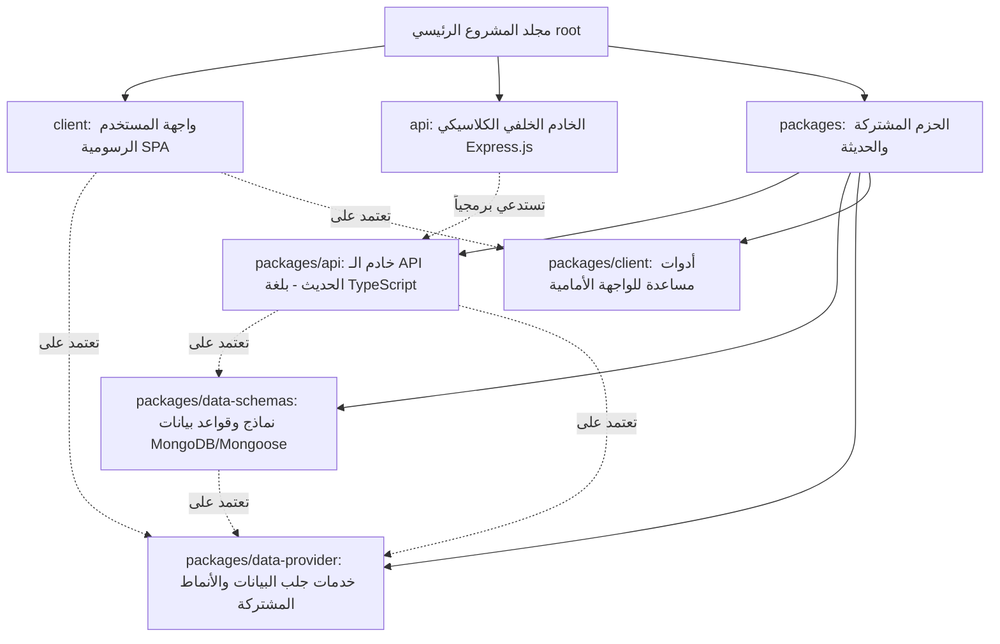
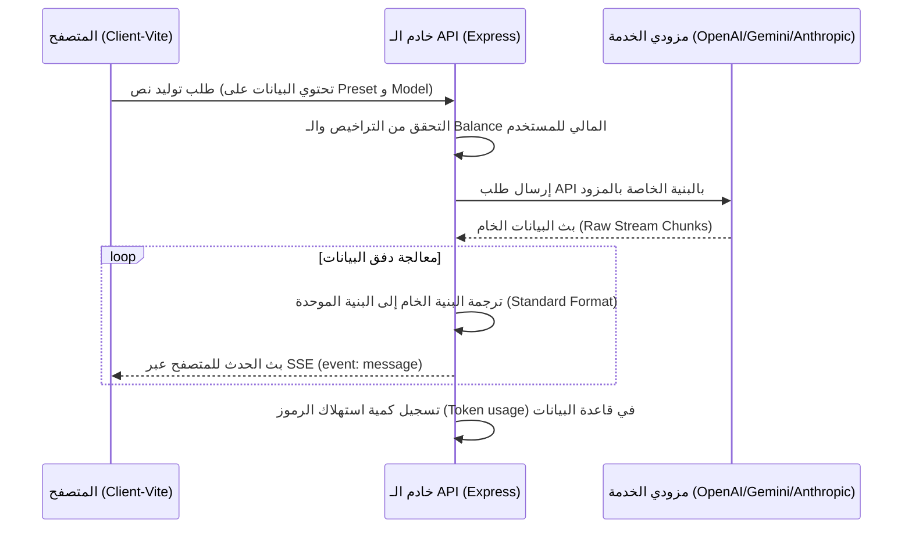
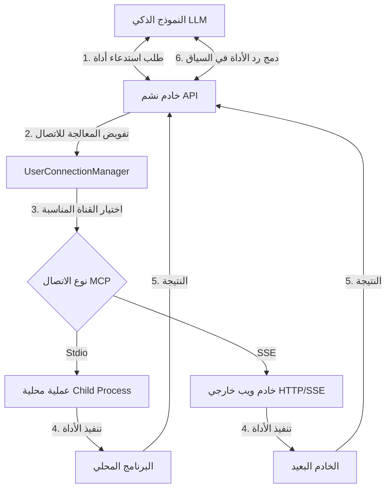
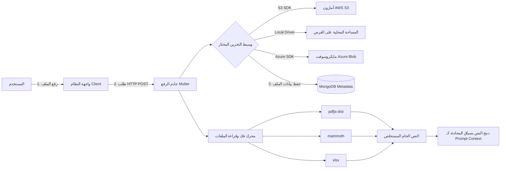
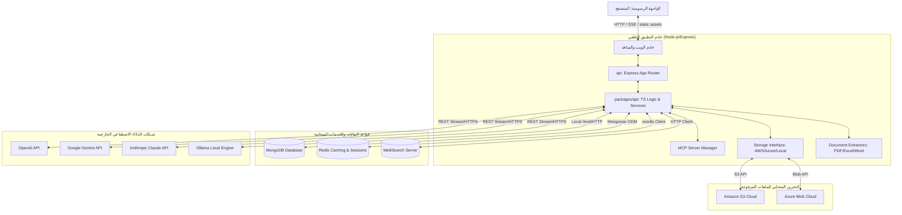
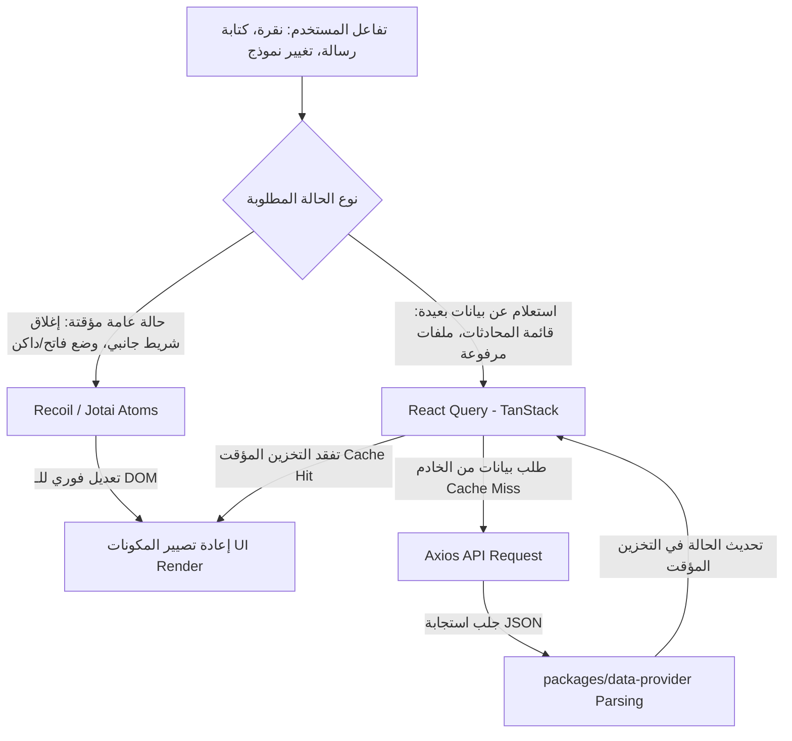
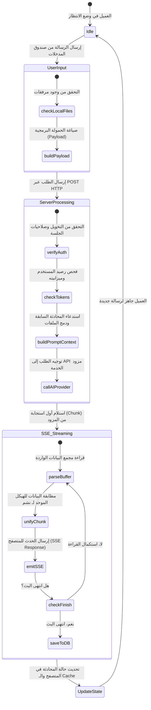
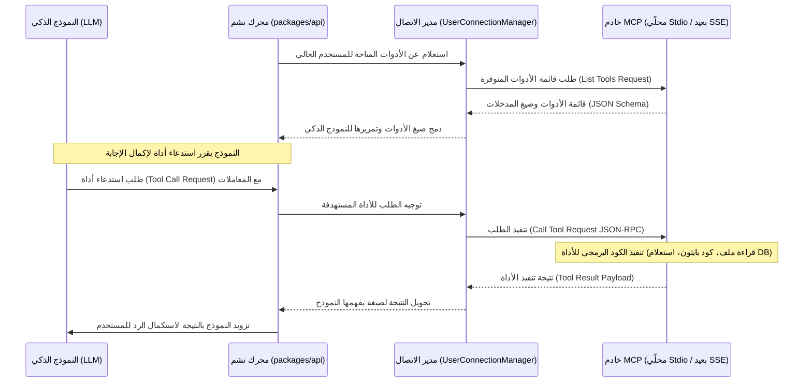

# دليل المعمارية والميزات البرمجية لنظام "نشم" (Nashm - Nashm Custom Edition)

يحتوي هذا المستند على مراجعة برمجية شاملة ومعمارية متكاملة لمشروع **"نشم"** (النسخة المخصصة والمهيأة من نظام Nashm الشهير). تم تصميم هذا التقرير ليغطي التفاصيل التقنية الدقيقة للواجهات الأمامية والخلفية، منطق عمل الميزات الأساسية، وقواعد البيانات، مدعوماً بمخططات برمجية وتوضيحية (Diagrams) احترافية تصف تدفق البيانات وهيكل النظام.

---

## 1. ملخص المشروع والبيئة الهيكلية (Project Overview & Monorepo Structure)

يتم بناء مشروع "نشم" كـ **Monorepo** (مستودع كود موحد يحتوي على عدة مشاريع فرعية) تتم إدارته واستضافته من خلال أداة **Turborepo** لتنظيم عمليات البناء والتشغيل والاعتماد المتبادل بين الحزم البرمجية المختلفة.

### هيكل المستودع والتبعيات (Workspaces & Dependency Tree)

### العلاقات بين المشاريع الفرعية:
1. **`client/` (Frontend)**: تطبيق ويب أحادي الصفحة (SPA) مبني بـ React ومجمع بواسطة أداة Vite. يعتمد على الحزمة المشتركة `packages/data-provider` لإجراء عمليات الاستدعاء والاتصال بالخادم.
2. **`api/` (Legacy Backend)**: خادم Express كلاسيكي بلغة JavaScript. تم تصميم هذا المجلد ليكون غلافاً خفيفاً للمهام التقليدية مع تفويض كافة العمليات المنطقية الجديدة إلى الحزمة الحديثة `packages/api`.
3. **`packages/api/` (Modern TypeScript Backend)**: المحرك الأساسي الجديد للخلفية (Backend Engine). يضم منطق ربط النماذج، والتحقق من التراخيص، وإدارة MCP، وتشغيل بروتوكول SSE لبث الردود. مكتوب بالكامل بلغة TypeScript ومترجم بواسطة `tsdown`.
4. **`packages/data-schemas/` (Mongoose DB Models)**: الطبقة الخاصة بتعريف جداول ونماذج قواعد البيانات باستخدام مكتبة Mongoose الخاصة بـ MongoDB، مما يتيح مشاركة نماذج البيانات كنوع من البيانات الآمنة (Type-Safe Models) بين الخوادم الفرعية.
5. **`packages/data-provider/` (Shared SDK)**: حزمة برمجية مشتركة ومحورية. تحتوي على إعدادات الـ API، عناوين الاتصال الموحدة (Endpoints)، معالجات الاستجابة (Parsers)، وأنواع البيانات البرمجية (TS Interfaces) التي يتشاركها كل من الواجهة الأمامية والخلفية لضمان تطابق البيانات المدخلة والمخرجة.

---

## 2. حزمة التقنيات المستخدمة (Technology Stack)

يعتمد مشروع "نشم" على مجموعة من أحدث وأقوى تقنيات الويب التي توفر أداءً عالياً وقابلية كبيرة للتوسع:

### أ. الواجهة الأمامية (Frontend Stack)
*   **الإطار الأساسي (Core UI Library)**: React 18 (تعتمد على المكونات الوظيفية Functional Components والـ Hooks).
*   **أداة البناء والتجميع (Bundler)**: Vite 8 لتوفير بيئة تطوير سريعة جداً وتجميع عالي الكفاءة للملفات الثابتة.
*   **إدارة الحالة (State Management)**:
    *   **Recoil (v0.7)** & **Jotai (v2.12)**: لإدارة الحالات العامة والمشتركة بين أجزاء الواجهة بشكل فوري وخفيف الوزن.
    *   **React Query / TanStack Query (v4)**: لإدارة وتخزين مؤقت (Caching) للبيانات القادمة من الـ API، والتعامل الذكي مع تحديثات الخلفية التلقائية.
*   **التنسيق والتصميم (Styling & Theme)**:
    *   **Tailwind CSS (v3.4)** لتصميم متجاوب وسريع.
    *   **Radix UI**: مكونات واجهة مستخدم غير منسقة (Primitives) لضمان سهولة الوصول والتفاعل التام (A11y/ARIA).
    *   **Framer Motion / React Spring**: لتأثيرات الحركة الميكروية (Micro-animations) والانتقالات السلسة بين الصفحات.
*   **ميزات الواجهة المتقدمة (Advanced UI Elements)**:
    *   **Monaco Editor & Sandpack React**: مدمج لتشغيل كتل الأكواد التفاعلية مباشرة في المتصفح ضمن بيئة معزولة (Sandbox).
    *   **Mermaid.js**: لتوليد المخططات والرسوم البيانية ديناميكياً داخل المتصفح عند إجابة الذكاء الاصطناعي.

### ب. الواجهة الخلفية (Backend Stack)
*   **إطار عمل الخادم (Framework)**: Node.js مع Express (الإصدار الخامس v5.2) للتعامل مع الطلبات وتوجيه المسارات.
*   **لغات البرمجة (Languages)**: TypeScript (في الحزم الحديثة) لتأمين بيئة آمنة للأنواع (Type-safe Environment) والحد من أخطاء وقت التشغيل، مع استخدام JavaScript (CommonJS) في خادم الـ API التقليدي.
*   **التأمين والتفويض (Auth & Security)**: Passport.js مع استراتيجيات متعددة للتسجيل المحلي والاجتماعي والمؤسساتي.
*   **معالجة الوثائق (File Processing)**:
    *   **Pdfjs-dist** لاستخلاص النصوص من ملفات PDF.
    *   **Mammoth** لقراءة ملفات Word (DOCX).
    *   **Xlsx / SheetJS** لقراءة ومعالجة جداول البيانات الإكسل.
    *   **Sharp** لمعالجة وتعديل وضغط الصور المرفوعة.

### ج. قواعد البيانات والتخزين المؤقت والبحث (Databases & Search Engines)
*   **قاعدة البيانات الأساسية (Primary Database)**: **MongoDB** مع استخدام **Mongoose** كمحرك برمجيات وسيط (ODM). يُسخدم لتخزين بيانات المستخدمين والمحادثات والملفات المرفوعة والرموز الترويجية والمهام والمؤشرات.
*   **التخزين المؤقت والتحكم بالوصول (Caching & Rate Limiting)**: **Redis** (عبر `ioredis` و `connect-redis` و `rate-limit-redis`) لإدارة جلسات المستخدمين (Sessions)، وتخزين البيانات المتكررة مؤقتاً لتخفيف الضغط على MongoDB، وضمان حماية النظام من الطلبات المفرطة (Rate Limiting).
*   **محرك البحث (Search Engine)**: **MeiliSearch** لتوفير ميزة البحث الفوري والشامل داخل نصوص المحادثات والرسائل السابقة بكفاءة وسرعة فائقة.

---

## 3. التحليل التفصيلي للميزات البرمجية (Core Features & Code Logic)

يحتوي تطبيق "نشم" على مجموعة من الميزات الذكية المتقدمة المصممة لتوفير تجربة تشبه وتتخطى الأنظمة السحابية المغلقة:

### الميزة الأولى: توجيه الطلبات لبث الذكاء الاصطناعي (Multi-Endpoint SSE Router)
*   **الفكرة والمنطق**:
    بدلاً من كتابة كود مخصص لكل مزود خدمة ذكاء اصطناعي (مثل OpenAI أو Anthropic أو Gemini)، يقوم النظام بإنشاء محول موحد (Unified Stream Parser) في الخلفية. عندما يقوم العميل بإرسال طلب توليد نص، يقوم الخادم بتحويل هيكل الطلب الموحد إلى الهيكل المطلوب لكل مزود، ثم يستقبل الردود كبث تدفقي (Server-Sent Events - SSE).
*   **آلية التنفيذ البرمجية**:
    *   يتم قراءة خيارات العميل عبر حزم الـ `presets` والـ `modelSpecs`.
    *   يتم استدعاء الدالة المناسبة لبدء الاتصال (مثل `OpenAIClient`, `GeminiClient`).
    *   تقوم الحزم في ملف `packages/api/src/stream` بقراءة دفق البيانات الخام (Stream Buffer) وتحويله فورا لشكل موحد (Chunk Standard) يحتوي على النص المولد، والرموز التعريفية، ومن ثم إرساله للمتصفح عبر ترويسة `text/event-stream`.

---

### الميزة الثانية: معيار سياق النموذج (Model Context Protocol - MCP)
*   **الفكرة والمنطق**:
    يتيح النظام للذكاء الاصطناعي قراءة البيانات واستدعاء العمليات البرمجية من أجهزة المستخدمين أو الخوادم الخارجية من خلال معيار MCP المطور من Anthropic. يمكن لمستخدمي "نشم" تثبيت خوادم MCP مخصصة (مثل قراءة قاعدة بيانات محلية، البحث في ملفات الجهاز، أو جلب معلومات الطقس)، وسيقوم النظام بتفويض الصلاحيات للأداة لتنفيذها والرد على سياق المحادثة.
*   **آلية التنفيذ البرمجية**:
    *   ملف `ConnectionFactory.ts` في `packages/api/src/mcp` يقوم بإنشاء قنوات اتصال عبر **Stdio Transport** (تشغيل عمليات فرعية محلياً على نظام التشغيل) أو **SSE Transport** (الاتصال بخادم MCP خارجي عبر الويب).
    *   يتم قراءة مخططات الأدوات (Tool Schemas) التي يعلن عنها خادم MCP، ويتم تمريرها للنموذج كمخططات استدعاء دوال (Function Calling).
    *   عندما يطلب النموذج استدعاء أداة، يوجهها الخادم إلى خادم الـ MCP المناسب، ويعيد الرد إلى النموذج لاستكمال إجابته.

---

### الميزة الثالثة: بيئة تشغيل الكود البرمجية المعزولة (Interactive Artifacts Sandbox)
*   **الفكرة والمنطق**:
    عندما يطلب المستخدم بناء تطبيق ويب تفاعلي أو صفحة إنترنت أو كود برمجي، لا يقوم النظام بعرضه ككود جاف فقط؛ بل ينشئ نافذة تفاعلية (شاشات عرض ذكية) تسمى **Artifacts** تمكن المستخدم من رؤية الكود وتشغيله والتعديل عليه وتصديره بشكل فوري في المتصفح.
*   **آلية التنفيذ البرمجية**:
    *   الخلفية في `packages/api/src/artifacts/update.ts` تبحث في سياق الرسائل عن وسم خاص هو `:::artifact` و `:::`.
    *   الواجهة الأمامية تستخدم مكتبة `@codesandbox/sandpack-react` لبناء حاوية برمجية معزولة داخل المتصفح (Iframe Sandboxed Runtime).
    *   تقوم الواجهة بحقن حزمة مسبقة التجهيز من مكونات **Shadcn UI** و **Radix UI** المخزنة في `packages/data-provider/src/artifacts.ts` كسلسلة نصية مباشرة في الحاوية التخيلية، مما يمكن الأكواد البرمجية من استيراد المكونات ديناميكياً بدون الحاجة لعمليات تجميع معقدة على خادم الويب.

---

### الميزة الرابعة: معالجة الوثائق وميزة التوليد المدعم بالاسترجاع (Document Parsing & Local RAG)
*   **الفكرة والمنطق**:
    تمكن هذه الميزة المستخدمين من رفع ملفات بمختلف التنسيقات (PDF, Word, Excel, CSV, text) ودمجها مباشرة في سياق السؤال للذكاء الاصطناعي إما عن طريق قراءتها مباشرة وإرسال محتواها كجزء من موجه النظام (Prompt System)، أو عن طريق تقسيمها وتخزينها في قاعدة بيانات موجهة (Vector embeddings) لتنفيذ مهام الـ RAG والبحث الدلالي.
*   **آلية التنفيذ البرمجية**:
    *   تستقبل الواجهة الخلفية الملف عبر وحدة `multer` وتخزنه بناءً على إعدادات المطور (إما محلياً، أو في AWS S3، أو Azure Blob Storage).
    *   تُرسل الملفات البرمجية لوحدات الاستخلاص:
        *   `pdfjs-dist`: لقراءة وتجريد ملفات PDF.
        *   `mammoth`: لملفات الـ DOCX.
        *   `xlsx`: لمعالجة جداول البيانات الكبيرة جداً وتجهيزها في مصفوفات JSON مدمجة.
    *   يتم تخزين بيانات الملف المعالج في نموذج `file.ts` في قاعدة البيانات لربطها بمالك الملف وتطبيق حماية الوصول ومنع التلاعب.

---

### الميزة الخامسة: إدارة صلاحيات المستخدمين والشركات (Projects & ACL Workspace Model)
*   **الفكرة والمنطق**:
    يدعم النظام تقسيم الحسابات إلى مساحات عمل (Projects) متعددة المستأجرين (Multi-tenancy). يمتلك كل مستخدم دوراً محدداً (Role) وصلاحيات (Permissions) تحكم النماذج التي يمكنه استخدامها، والأدوات التي يستطيع تفعيلها، وإمكانية تعديل البيانات، مع وجود سجل كامل للعمليات (Audit Log) لأغراض المراجعة والأمن.
*   **آلية التنفيذ البرمجية**:
    *   يتم إدارة هذه القواعد عبر نموذجي قواعد البيانات `accessRole.ts` و `aclEntry.ts` في حزمة `packages/data-schemas`.
    *   يتم تضمين برمجة وسيطة (Middleware) في خادم Express للتحقق من هوية وصلاحية المستخدم تجاه المشروع النشط قبل تنفيذ أي إجراء.
    *   تحتوي حزمة `packages/data-provider/src/accessPermissions.ts` على دوال مخصصة للمتصفح مثل `hasPermission()` لإخفاء أو إظهار أجزاء من واجهة المستخدم بناءً على مصفوفة الصلاحيات الممنوحة للمستخدم داخل المشروع الحالي.

---

### الميزة السادسة: المصادقة المتعددة وتأمين الدخول (Comprehensive Auth & SSO Pipeline)
*   **الفكرة والمنطق**:
    يدعم نظام "نشم" آليات مصادقة قوية ومتنوعة تناسب الأفراد والشركات والبيئات الحكومية المغلقة أو السحابية. يجمع بين التسجيل التقليدي المشفر والربط بحسابات التواصل الاجتماعي والمؤسسات الخدمية.
*   **آلية التنفيذ البرمجية**:
    *   **التسجيل المحلي (Local Auth)**: يتم تشفير كلمات المرور باستخدام خوارزمية `bcryptjs` وحفظ الجلسات عبر `express-session` في مخزن Redis لسرعة الاسترجاع وتأمين الخروج الفوري.
    *   **الربط الاجتماعي (OAuth)**: عبر استراتيجيات Passport.js لـ (Google, GitHub, Facebook, Discord, Apple).
    *   **المصادقة المؤسسية (SSO)**: عبر بروتوكولات **SAML** (عبر `passport-saml`) و **LDAP** (لبيئات شبكات ويندوز ومجلدات النشاط النشطة) و **OpenID Connect**.
    *   **التأمين الثنائي (MFA/2FA)**: عبر توليد رموز QR ديناميكية في المتصفح باستخدام `qrcode.react` ومطابقة كود التحقق في الخلفية.

---

### الميزة السابعة: مكتبة الموجهات والروابط التشاركية (Prompt Library & Shared Links)
*   **الفكرة والمنطق**:
    *   **مكتبة الموجهات (Prompt Library)**: توفر بيئة للمستخدمين والفرق لبناء قوالب موجهات نظام (System Prompts) جاهزة يمكن تفعيلها بمجرد الضغط عليها أو استدعائها برمز `@` في محادثة الذكاء الاصطناعي مع دعم متغيرات ديناميكية يتم تعبئتها من قبل المستخدم.
    *   **الروابط التشاركية (Shared Links)**: تتيح مشاركة نسخة للقراءة فقط من أي محادثة مع الآخرين عبر كود فك ترميز وحفظ للحالة في نفس الوقت.
*   **آلية التنفيذ البرمجية**:
    *   تعتمد مكتبة الموجهات على نموذجي `prompt.ts` و `promptGroup.ts` لتسهيل تنظيم وتصنيف وتعديل القوالب ومشاركتها عبر مساحة العمل المشتركة.
    *   الروابط التشاركية يتم التحكم بها برمجياً عبر ملف `packages/api/src/shared-links`؛ حيث يتم استنساخ هيكلية الرسائل في لحظة المشاركة وحفظها برابط معرف فريد (UUID) لضمان بقائها حتى لو قام المستخدم بتعديل المحادثة الأصلية لاحقاً.

---

### الميزة الثامنة: الفوترة والتحكم بالميزانيات (Billing, Token Accounting & Subscriptions)
*   **الفكرة والمنطق**:
    منع إساءة استخدام موارد الـ APIs عن طريق وضع نظام محاسبة مالي دقيق داخل الخادم يحسب كمية الكلمات المدخلة والمخرجة (Input/Output Tokens) وخصم قيمتها الفعلية من محفظة المستخدم المالية أو رصيد اشتراكه الشهري.
*   **آلية التنفيذ البرمجية**:
    *   يتم استخدام مكتبة `ai-tokenizer` في الحزمة البرمجية لقياس عدد الرموز المستهلكة بدقة بالاعتماد على معايير تشفير تماثل المزودين.
    *   يحتوي النظام على ملفات متخصصة في إدارة الرصيد مثل `add-balance.js` ونموذج `balance.ts` و `transaction.ts`.
    *   يتم دمج خوادم الدفع الخاصة بـ **Stripe** لاستقبال عمليات الشحن والاشتراكات الدورية وتفعيل الرصيد تلقائياً عبر خطافات الويب (Webhooks).

---

## 4. المخططات التوضيحية وتدفق البيانات (Architectural & Data Flow Diagrams)

يغطي هذا القسم تدفق البيانات بشكل تفصيلي للواجهة الأمامية والخلفية وسياق المحادثة.

### أ. مخطط النظام البرمجي الشامل (Full System Topology)

يوضح هذا المخطط المكونات المادية والبرمجية وكيفية تواصلها مع العميل الخارجي:

---

### ب. تدفق دورة حياة الواجهة الأمامية وإدارة الحالات (Frontend State Lifecycle & Flow)

يوضح هذا المخطط كيف تتفاعل الواجهة الرسومية باستخدام Recoil/Jotai والتكامل مع React Query لجلب وتحديث واجهات النظام:

---

### ج. دورة حياة بث ومعالجة الرسائل والذكاء الاصطناعي (Chat Streaming Lifecycle)

مخطط تفصيلي للمزامنة بين العميل والخادم ومزود الخدمة لمعالجة وإنشاء وبث النصوص:

---

### د. دورة تشغيل خوادم وأدوات الـ MCP (MCP Execution Lifecycle Diagram)

يوضح المخطط كيف يقوم النظام بفرز الأدوات المتاحة لخوادم MCP وتوجيه استدعاءات النماذج لها محلياً أو سحابياً:

---

## 5. الخلاصة والتوصيات الهندسية لبيئة التطوير

يمثل مشروع **"نشم"** بيئة عمل متكاملة تتفوق في مرونتها التقنية وتنظيمها البرمجي. وبفضل الفصل الواضح بين المهام داخل الـ Monorepo:
1. **الواجهة الأمامية خفيفة وسريعة**: تركز فقط على تصيير المكونات وحفظ الحالة المؤقتة وإدارة دفق الكود للـ Sandbox.
2. **الخلفية متينة وآمنة**: تقسم العبء بين تجميع واستخلاص الملفات محلياً، والحفاظ على جلسات المستخدمين متزامنة ومرتبطة بقواعد البيانات بكفاءة تامة من خلال Redis و MongoDB.

### توصيات هامة للمطورين عند تعديل الكود:
*   **تعديل خيارات الاتصال بالـ APIs**: يجب إجراؤه في ملف `packages/data-provider/src/api-endpoints.ts` لضمان تحديث المسارات للمتصفح والخادم تلقائياً في نفس الوقت.
*   **إنشاء جداول جديدة وقوالب تخزين**: يتم بالكامل في مجلد `packages/data-schemas/src/models/` لضمان المحافظة على تكامل البيانات والـ Mongoose Schema.
*   **بناء وتحديث الحزم المشتركة**: قبل البدء بتطوير الواجهة الأمامية أو تشغيلها بعد إجراء أي تعديل برمي على الحزم المساعدة، يجب تشغيل أمر التجميع الموحد `npm run build` لضمان تحديث مجلدات الـ `dist` لجميع الحزم وربطها بشكل سليم.
