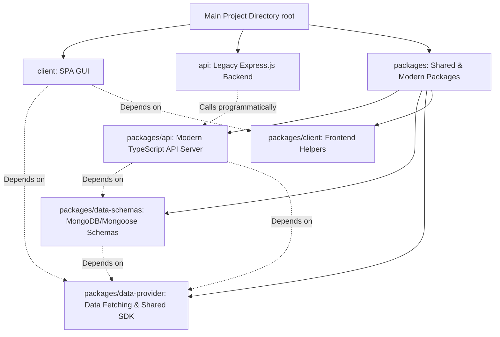
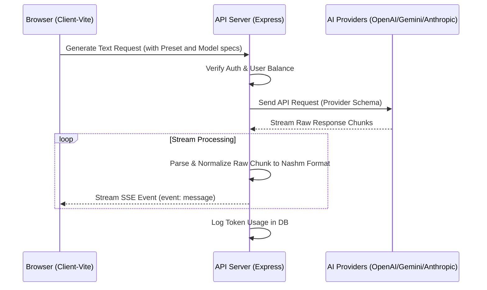
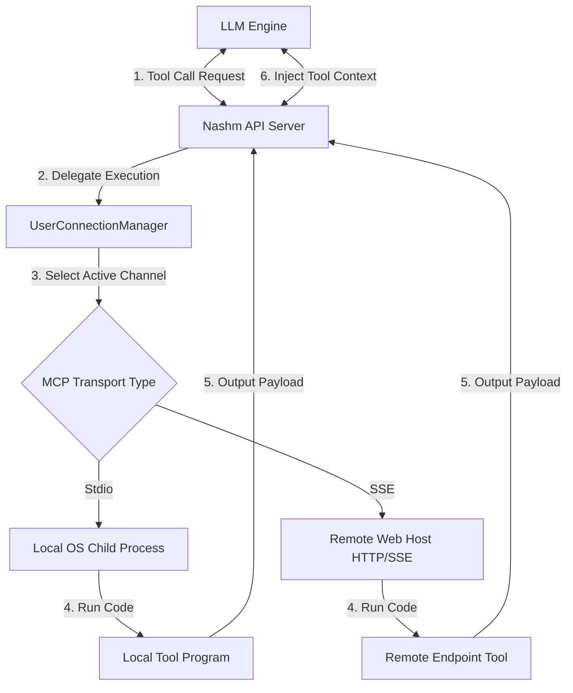
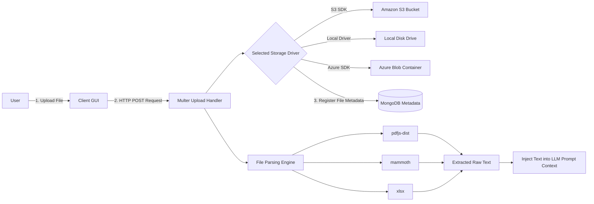
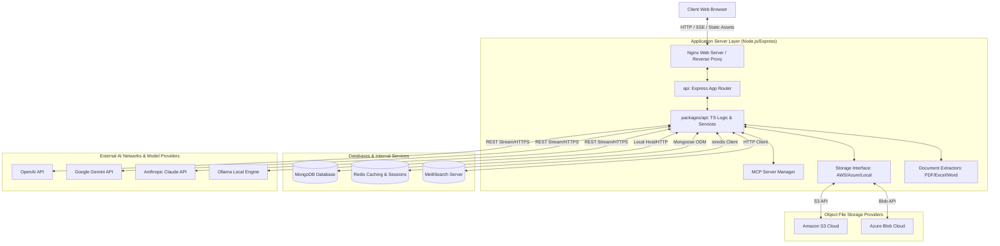
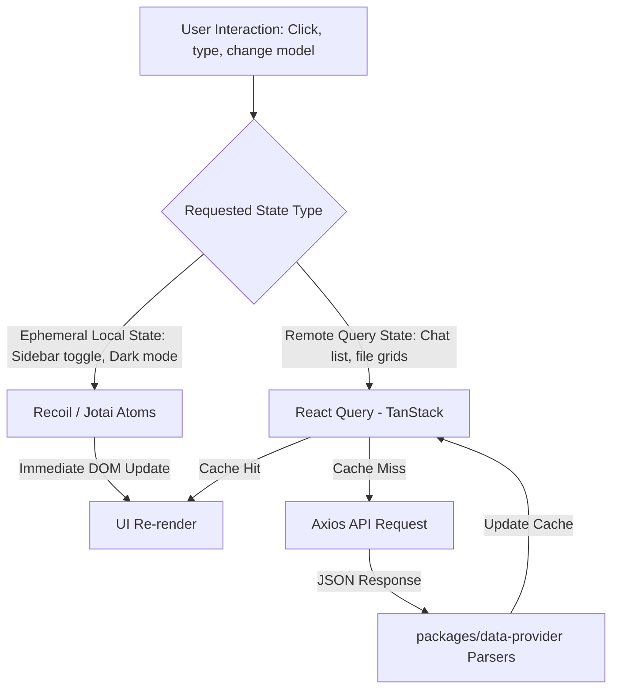
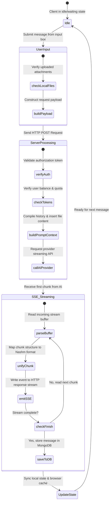
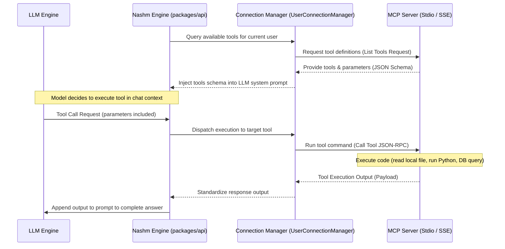

# Architectural & Feature Documentation for "Nashm" (Nashm - LibreChat Custom Edition)

This document provides a comprehensive code review and integrated architecture analysis for the **"Nashm"** project (a customized and tailored edition of the famous LibreChat system). This report is designed to cover the precise technical details of both the frontend and backend, the logic behind core features, and databases, supported by professional architectural diagrams illustrating data flow and system structure.

---

## 1. Project Overview & Monorepo Structure

The "Nashm" project is built as a **Monorepo** (a single repository containing multiple sub-projects/workspaces) managed and hosted using **Turborepo** to organize build processes, execution, and inter-dependencies between various code packages.

### Workspaces & Dependency Tree

### Relations Between Sub-Projects:
1. **`client/` (Frontend)**: A Single Page Application (SPA) built with React and bundled using Vite. It depends on the shared package `packages/data-provider` for making API requests and communicating with the server.
2. **`api/` (Legacy Backend)**: A classic Express server in JavaScript. This directory is designed as a lightweight wrapper for legacy tasks while delegating all new business logic to the modern package `packages/api`.
3. **`packages/api/` (Modern TypeScript Backend)**: The core engine for the new backend. It handles model routing, license verification, MCP management, and SSE protocol for streaming responses. It is written entirely in TypeScript and bundled using `tsdown`.
4. **`packages/data-schemas/` (Mongoose DB Models)**: The database layer that defines tables and models using Mongoose for MongoDB, enabling type-safe model sharing between backend workspaces.
5. **`packages/data-provider/` (Shared SDK)**: A pivotal, shared software development kit. It contains API configurations, unified endpoints, response parsers, and TypeScript interfaces shared between frontend and backend to guarantee consistent input/output data structures.

---

## 2. Technology Stack

The "Nashm" project relies on a stack of modern and powerful web technologies that deliver high performance and scalability:

### A. Frontend Stack
*   **Core UI Library**: React 18 (utilizing functional components and React hooks).
*   **Bundler**: Vite 8 to provide an ultra-fast development environment and highly efficient static asset bundling.
*   **State Management**:
    *   **Recoil (v0.7) & Jotai (v2.12)**: For lightweight, instant global state management shared across the interface.
    *   **React Query / TanStack Query (v4)**: For API data caching, state management, and smart auto-synchronization with backend changes.
*   **Styling & Theme**:
    *   **Tailwind CSS (v3.4)**: For rapid, responsive designs.
    *   **Radix UI**: Unstyled UI primitives ensuring complete accessibility (A11y/ARIA) and custom interaction support.
    *   **Framer Motion / React Spring**: For subtle transitions and micro-animations to enhance user experience.
*   **Advanced UI Elements**:
    *   **Monaco Editor & Sandpack React**: Integrated to run interactive, sandboxed code execution environments directly inside the browser.
    *   **Mermaid.js**: For dynamically rendering flowcharts and diagrams directly in the browser when generated by AI.

### B. Backend Stack
*   **Server Framework**: Node.js with Express (v5.2) to handle API requests and route definitions.
*   **Programming Languages**: TypeScript (in modern packages) to secure a type-safe environment and reduce runtime errors, alongside JavaScript (CommonJS) in the legacy API server wrapper.
*   **Authentication & Security**: Passport.js with multiple strategies supporting local, social, and enterprise authentication.
*   **File & Document Processing**:
    *   **pdfjs-dist**: For parsing and extracting text content from PDF files.
    *   **mammoth**: For reading and processing Microsoft Word (.docx) documents.
    *   **xlsx / SheetJS**: For importing and handling large Excel sheets.
    *   **sharp**: For processing, resizing, and compressing uploaded images.

### C. Databases, Caching & Search Engines
*   **Primary Database**: **MongoDB** with **Mongoose** as an ODM. It stores user data, chat transcripts, file metadata, promo codes, background jobs, and system metrics.
*   **Caching & Access Control (Rate Limiting)**: **Redis** (via `ioredis`, `connect-redis`, and `rate-limit-redis`) for user session management, caching hot queries to reduce MongoDB workload, and enforcing rate limiting.
*   **Search Engine**: **MeiliSearch** to deliver instant, high-performance full-text search across past chats and message histories.

---

## 3. Detailed Software Feature Analysis

The "Nashm" application features advanced, intelligent capabilities designed to provide an experience matching or exceeding closed-source cloud AI systems:

### Feature 1: Multi-Endpoint SSE Streaming Router
*   **Concept & Business Logic**: Instead of writing bespoke client logic for each AI provider (e.g., OpenAI, Anthropic, or Gemini), the system implements a Unified Stream Parser in the backend. When a client requests token generation, the server converts the unified payload schema to the provider's specific format, receives the response, and streams it back to the client using Server-Sent Events (SSE).
*   **Code Implementation Flow**:
    *   Client options are parsed from `presets` and `modelSpecs` packages.
    *   The corresponding service initializer is triggered (e.g., `OpenAIClient`, `GeminiClient`).
    *   Code in `packages/api/src/stream` parses the raw provider stream buffer, normalizes it into a standard chunk format (containing generated text, token IDs, etc.), and streams it to the browser via the `text/event-stream` header.

---

### Feature 2: Model Context Protocol (MCP) Integration
*   **Concept & Business Logic**: The system allows the AI to fetch data and trigger code execution from user machines or external services using Anthropic's Model Context Protocol (MCP). Nashm users can configure local/remote MCP servers (e.g., reading a local database, searching directories, or calling weather APIs), and the server delegates function execution to the tool, returning the output to the LLM context.
*   **Code Implementation Flow**:
    *   `ConnectionFactory.ts` in `packages/api/src/mcp` instantiates transport channels using **Stdio Transport** (spawning local OS child processes) or **SSE Transport** (connecting to remote MCP servers via Web sockets/HTTP).
    *   Declared tool schemas from the MCP server are parsed and injected into the LLM payload as standard function-calling schemas.
    *   When the LLM requests a tool call, the server handles and dispatches the execution request to the appropriate MCP channel, returning the outcome to the LLM to continue writing its response.

---

### Feature 3: Interactive Artifacts Sandbox
*   **Concept & Business Logic**: When a user requests interactive UI components, web pages, or scripts, Nashm doesn't merely display raw code. It spawns an interactive sandbox workspace called **Artifacts**, allowing the user to view, edit, run, and export compiled code on-the-fly inside the browser.
*   **Code Implementation Flow**:
    *   The backend parser in `packages/api/src/artifacts/update.ts` scans the generated message stream for specific XML-like tokens (e.g., `:::artifact` and `:::` blocks).
    *   The frontend intercepts these blocks and uses `@codesandbox/sandpack-react` to assemble an in-browser isolated execution frame (Iframe Sandbox).
    *   It dynamically injects pre-transpiled UI component packages (including **Shadcn UI** and **Radix UI** schemas stored in `packages/data-provider/src/artifacts.ts`) into the virtual workspace filesystem, allowing sandboxed code to resolve and load modules without any remote compiler overhead.

---

### Feature 4: Document Parsing & Local Retrieval-Augmented Generation (RAG)
*   **Concept & Business Logic**: This feature enables users to upload documents in various file types (PDF, DOCX, XLSX, CSV, plain text) and inject their contents into the LLM context. This can be handled by either reading the raw extracted text as system prompts, or by indexing and embedding file chunks in a vector database for semantic search and local RAG workflows.
*   **Code Implementation Flow**:
    *   The backend accepts files via `multer` middleware and directs them to the configured storage driver (Local storage, Amazon S3, or Azure Blob Storage).
    *   Files are routed to their respective extractor engines:
        *   `pdfjs-dist`: Extracts plaintext layers from PDFs.
        *   `mammoth`: Translates Word DOCX schemas to clean text.
        *   `xlsx`: Parses spreadsheets and processes worksheets into dense JSON arrays.
    *   The processed metadata is registered under the `file.ts` schema in MongoDB to associate files with their owner and enforce access control list (ACL) rules.

---

### Feature 5: Multi-Tenant Workspace & Access Control List (ACL) Model
*   **Concept & Business Logic**: The system supports dividing user spaces into projects using a multi-tenancy architecture. Each user holds specific roles and permissions restricting which LLM models they can load, which tools they can trigger, or whether they can alter workspace assets, with a comprehensive audit trail for enterprise governance.
*   **Code Implementation Flow**:
    *   Access policies are controlled via the `accessRole.ts` and `aclEntry.ts` database schemas inside the `packages/data-schemas` workspace.
    *   Express middleware filters and validates user credentials against the target active Project before any route resolver is run.
    *   `packages/data-provider/src/accessPermissions.ts` exports helper functions like `hasPermission()` to conditionally hide/show UI controls in the React client based on the client's current role assignment.

---

### Feature 6: Comprehensive Authentication & Single Sign-On (SSO) Pipeline
*   **Concept & Business Logic**: Nashm supports multi-tiered authentication methods tailored for individuals, companies, and secure closed government/intranet systems. It blends classic password authentication with major social and corporate directories.
*   **Code Implementation Flow**:
    *   **Local Auth**: Passwords are encrypted using the `bcryptjs` algorithm and sessions are persisted via `express-session` on Redis for instant lookup and global logouts.
    *   **OAuth Integrations**: Built using standard Passport.js strategies for platforms like Google, GitHub, Facebook, Discord, and Apple.
    *   **Enterprise SSO**: Supports **SAML 2.0** (`passport-saml`), **LDAP** directories (for Windows Active Directory networks), and **OpenID Connect**.
    *   **Multi-Factor Auth (MFA/2FA)**: Generates TOTP secrets and QR codes using `qrcode.react` in the frontend and verifies validation tokens on the backend before finalizing sessions.

---

### Feature 7: Prompt Library & Shared Links
*   **Concept & Business Logic**:
    *   **Prompt Library**: Provides a collaborative playground for teams to pre-define System Prompt templates. These can be selected from a prompt drawer or invoked by typing `@` inside the message input box, supporting dynamic placeholder variables.
    *   **Shared Links**: Generates read-only snapshot links of conversations for external sharing.
*   **Code Implementation Flow**:
    *   The Prompt Library references `prompt.ts` and `promptGroup.ts` schemas in the database, allowing workspace members to group, tag, edit, and share templates.
    *   Shared Links logic in `packages/api/src/shared-links` duplicates the session's message states in a static snapshot document indexed under a unique UUID, preserving the message layout exactly as it was when shared.

---

### Feature 8: Token Accounting, Billing & Subscriptions
*   **Concept & Business Logic**: To prevent resource abuse, the system integrates a real-time token ledger calculating prompt (input) and response (output) tokens, charging the usage fee directly from the user's balance wallet or monthly quota allocation.
*   **Code Implementation Flow**:
    *   The system uses the `ai-tokenizer` package to accurately measure consumption metrics matching the standard tokenizer definitions of each model provider.
    *   Financial transactions and wallets are modeled under the `balance.ts` and `transaction.ts` schemas, supported by backend modules like `add-balance.js`.
    *   **Stripe** payment gateways are integrated to support automated wallet deposits and recurring subscription tiers, processed asynchronously via webhooks.

---

## 4. Architectural & Data Flow Diagrams

This section covers detailed architectural data paths for the frontend, backend, and chat lifecycles.

### A. Full System Topology

This diagram illustrates physical and logical system components, detailing client-to-service communications:

---

### B. Frontend State Lifecycle & Flow

This diagram explains how the React UI coordinates local state stores (Recoil/Jotai) with remote query layers (React Query) to update system interfaces:

---

### C. Chat Streaming Lifecycle

A detailed state machine tracking client, server, and LLM synchronization during token streaming:

---

### D. MCP Execution Lifecycle

This sequence illustrates how tools are gathered from active MCP servers, parsed for model payloads, and executed synchronously:

---

## 5. Summary & Engineering Recommendations for Developers

The **"Nashm"** project presents a mature workspace structure characterized by architectural flexibility and organized codebase. Due to clean Separation of Concerns (SoC) within the Monorepo:
1. **Lightweight & Fast Frontend**: Focuses strictly on UI components rendering, client state management, and running the sandboxed iframe runtime.
2. **Robust & Secure Backend**: Splits core operations between parsing and extracting files, persisting secure session cache structures, and maintaining MongoDB states efficiently through Redis.

### Vital Guidelines for Developers:
*   **Modifying API Endpoints**: Must be performed inside `packages/data-provider/src/api-endpoints.ts` to ensure consistency between client networks and server routes automatically.
*   **Creating New DB Collections & Schemas**: Must be declared entirely inside `packages/data-schemas/src/models/` to maintain Mongoose models integrity and Type-Safety.
*   **Rebuilding Shared Packages**: Before starting development or executing build paths, run `npm run build` at the root after any modifications in helper modules to ensure up-to-date distribution (`dist/`) builds across the workspace workspaces.
